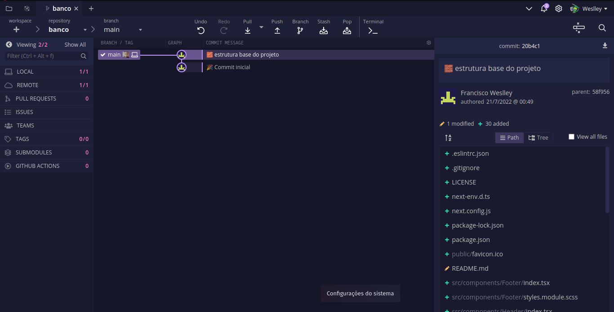

<h1>Dracula High Contrast Theme 🧛🏻‍♂️</h1>

</img>

## OVERVIEW

In addition to standard themes, GitKraken now supports user-customized themes!

# Installation
- Copy the \*.jsonc file of your desired theme in your GitKraken theme folder. On Windows it's usually located at: `C:\Users\*Username*\AppData\Roaming\.gitkraken\themes`.
- Copy the \*.jsonc file of your desired theme in your GitKraken theme folder. On Linux it's usually located at: `/home/*Username*/.gitkraken/themes/`.
- Select your theme under `Preferences -> UI Customization`.
- See also the official GitKraken [Documentation](https://support.gitkraken.com/start-here/themes/).

# Theme Image
</img>